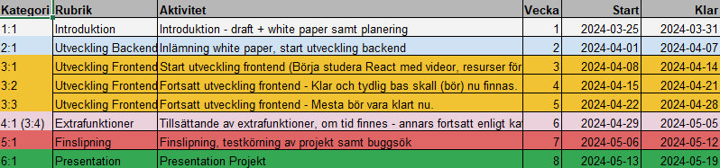

# Project name Snöfjällby Ski Resort Application - with PowderTracker®

## Description

A Java Spring Boot application that serves as a server for a fictive Ski Resort Application. 

The application uses various things like Spring Security 6 with JSON Web Token for authorization and authentication, NoSQL MongoDB for data storage, Microsoft Azure deployment and JUnit unit-test for testing.

This project is an examwork of a 2-year higher java YH-education at Campus Mölndal, gothenburg, Sweden, where i as student wanted to both combine as many previous learned technologies as possible and equally the same learn new ones.

The Application is meant to be the ultimate Ski Resort application for both managers, employees and guests at the resort.
* Managers can handle typical and overall employee and guest requests, 
* Employees can handle the daily running of the resort as well the common store, and some of its own data.
* Guests (Users) can book a stay, rent equipment, book ski lessons, and see the current weather and snow conditions.

In the creation and nagging of following both the TRAP-plan (In swedish)

<p align="center">

</p>

I learned <u>alot</u> about endpoints, http-requests and common work about how connection between a server and a client works, which was for me very grateful.

## Installation

1. Clone the repository
```https://github.com/Cristoffer85/SnofjallbyWithPT-Backend``` from Github
2. In application.properties, change the following to your own settings:
```spring.data.mongodb.uri=${MONGODB_URI:mongodb://localhost:27017/<your database name>}``` the MONGODB_URI is a environment variable that you can set in your IDE or in your deployment environment. By default if the MONGODB_URI is not set, it will use the local MongoDB database.
3. Run the application in your IDE or (quick-cheat) here: ```mvn spring-boot:run```

## Usage


## Credits
Classmates from school, Myself, my Family, mighty duck rubber duck and some coPilot and chatGPT for debugging.

## License
🏆 MIT License

## Badges


## Features
ADMIN, can:
* Login, handle every CRUD functionality for every Employee and Guest

EMPLOYEE, can:
* Login, handle every CRUD functionality for every product in Store, Ski Lift operations and some personal data.

Guest (User), can:
* Sign up, Login, Book a stay, Rent equipment, Book ski lessons, View previous orders and total cost, See current weather and snow conditions, manage some of its personal data.


## Tests
JUNit tests are located in the test folder and can be run from there. Covering every controller and service class.
